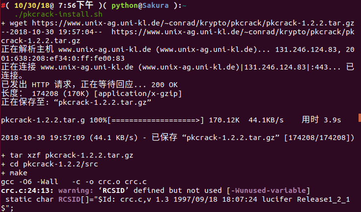
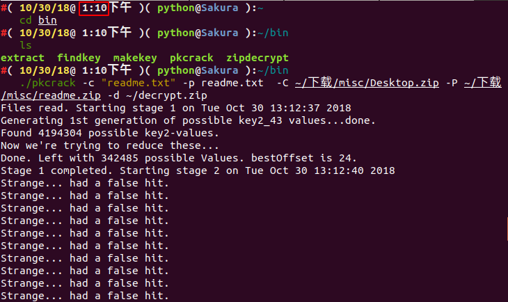
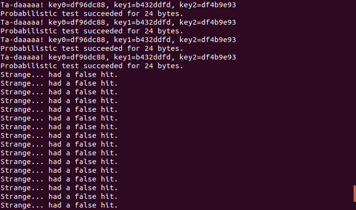
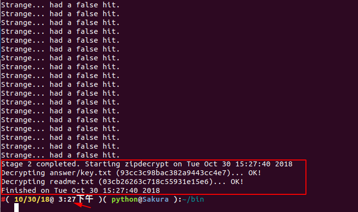

## File Structure


The `ZIP` file is mainly composed of three parts, respectively


| local file header + file data + data descriptor | central directory | end of central directory record |
| ----------------------------------------------- | ----------------- | ------------------------------- |


Each compressed source file or directory in the compressed source file data area is a record:

- `local file header` : file header is used to identify the beginning of the file. The file header identifier starts with a fixed value of `50 4B 03 04`
- `file data` : file data records the data of the corresponding compressed file
- `data descriptor`: data descriptor is used to identify the end of the file compression. This structure appears only when the 3rd bit of the generic tag field in the corresponding `local file header` is set to `1` immediately after the compressed file source data
- `Central directory` central directory is used to record directory information. Each record in this data area corresponds to one data area in the compressed source file


| Offset | Bytes | Description                                          |
| ------ | ----- | ---------------------------------------------------- |
| 0      | 4     | Central directory file header signature = 0x02014b50 |
| 4      | 2     | Version made by                                      |
| 6      | 2     | Version needed to extract (minimum)                  |
| 8      | 2     | General purpose bit flag                             |
| 10     | 2     | Compression method                                   |
| 12     | 2     | File last modification time                          |
| 14     | 2     | File last modification date                          |
| 16     | 4     | CRC-32                                               |
| 20     | 4     | Compressed size                                      |
| 24     | 4     | Uncompressed size                                    |
| 28     | 2     | File name length (n)                                 |
| 30     | 2     | Extra field length (m)                               |
| 32     | 2     | File comment length (k)                              |
| 34     | 2     | Disk number where file starts                        |
| 36     | 2     | Internal file attributes                             |
| 38     | 4     | External file attributes                             |
| 42     | 4     | relative offset of local header                      |
| 46     | n     | File name                                            |
| 46+n   | m     | Extra field                                          |
| 46+n+m | k     | File comment                                         |


- `End of central directory record(EOCD)` end of directory identifier, exists at the end of the entire archive package and is used to mark the end of compressed catalog data. Each compressed file must have one and only one EOCD record


See [Official Documentation](https://pkware.cachefly.net/webdocs/APPNOTE/APPNOTE-6.2.0.txt) for more details.


## Attack Methods


### Brute Force


Here are two tools for brute forcing `zip`.


- Windows (Paid) - [ARCHPR](https://www.elcomsoft.com/archpr.html)


    


- Linux (Free) - [fcrackzip](https://github.com/hyc/fcrackzip)

    Example command: `root@kali: fcrackzip -b -c1 -u test.zip`
    > -b for brute force mode, -c1 specifies password character set to be numbers, -u validates the password with `unzip`, -l 5-6 specifies password length


### CRC32


#### Basics


`CRC` stands for cyclic redundancy check, and `CRC32` means that a check value of `32 bit` is generated. Since every bit of a `CRC32` value is used in the calculation, when one bit changes in the data block, a different `CRC32` value will be generated.

The `CRC32` checksum appears in many files such as a `png` file, as well as the `CRC32` checksum in `zip`. It is worth noting that `CRC32` in `zip` is the checksum value of the unencrypted files.


This has led to an attack method based on `CRC32`.


- There is very little content in the file (it is about `4` bytes, in most CTFs)
- Encrypted password is very long


Instead of brute forcing the password of zip file , we can brute force the contents of the plaintext file (usually strings) to obtain what we want.


For example, we created a new `flag.txt` with the content `123` and encrypt it with the password `!QAZXSW@#EDCVFR$`.


Then, we calculated the `CRC32` value of the file within the encrypted zip and found that it matches the `CRC32` value in the above figure.


```shell
File: flag.txt
Size: 3
Time: Tue, 29 Aug 2017 10:38:10 +0800
MD5: 202cb962ac59075b964b07152d234b70
SHA1: 40bd001563085fc35165329ea1ff5c5ecbdbbeef

CRC32: 884863D2
```

!!! note
    When brute forcing, we could try to get all possible strings' `CRC32` value and compare it with the `CRC32` value of file within the compressed zip file.

Here is a `CRC32` brute force script:

!!! note
    Run this script in Python2

```python
import binascii
import base64
import string
import itertools
import struct

alph = 'abcdefghijklmnopqrstuvwxyzABCDEFGHIJKLMNOPQRSTUVWXYZ0123456789+/='

crcdict = {}
print "computing all possible CRCs..."
for x in itertools.product(list(alph), repeat=4):
    st = ''.join(x)
    testcrc = binascii.crc32(st)
    crcdict[struct.pack('<i', testcrc)] = st
print "Done!"

f = open('flag.zip')
data = f.read()
f.close()
crc = ''.join(data[14:18])
if crc in crcdict:
    print crcdict[crc]
else:
    print "FAILED!"
```


#### CTF Example


##### Abctf-2016 - Zippy

> Download the challenge file [here](https://github.com/ctf-wiki/ctf-challenges/blob/master/misc/archive/zip/Abctf-2016-Zippy/zippy.zip)

Based on the file size of each compressed file, it can be inferred that the `CRC32` attack method can be used.

You can brute force the `CRC32` value for all the compressed files. After that you concatenate the contents from each compressed file to get a base64 string, decode that will get you the flag.

You can use this script to brute force `CRC32` values and obtain the content of each compressed file:

!!! note
    Run this script in Python2

```python
# unzip to file ./zippy dirctory
import binascii
import base64
import string
import itertools
import struct

alph = 'abcdefghijklmnopqrstuvwxyzABCDEFGHIJKLMNOPQRSTUVWXYZ0123456789+/='

crcdict = {}
print "computing all possible CRCs..."
for x in itertools.product(list(alph), repeat=4):
    st = ''.join(x)
    testcrc = binascii.crc32(st)
    crcdict[struct.pack('<i', testcrc)] = st
print "Done!"

for i in range(54):
    f = open("./zippy/chunk{}.zip".format(i))
    data = f.read()
    f.close()
    crc = ''.join(data[14:18])
    if crc in crcdict:
        print crcdict[crc]
    else:
        print "FAILED!"
```

We got the following base64 string: `UEsDBBQDAQAAAJFy1kgWujyNLwAAACMAAAAIAAAAZmxhZy50eHT/xhoeSnjMRLuArw2FXUAIWn8UQblChs4AF1dAnT4nB5hs2SkR4fTfZZRB56Bp/FBLAQI/AxQDAQAAAJFy1kgWujyNLwAAACMAAAAIAAAAAAAAAAAAIIC0gQAAAABmbGFnLnR4dFBLBQYAAAAAAQABADYAAABVAAAAAAA=`

The base64 string decodes to another zipfile, which is password protected.

Let's brute force the password with `fcrackzip`:

`fcrackzip -b -c 'Aa1' -l 1-5 -v -u flag.zip`
  - -b, brute force mode
  - -c 'Aa1', character set lowercase and uppercase letters, numbers
  - -l 1-5, password length 1-5
  - -u double check password to avoid false positives

We got the password: `z1P`

Flag: `flag{i_z1pp3d_a_zip_w1th_sum_zips}`


### Clear text attack


#### Basics


- an encrypted compressed file

- A software to compress files, such as, `7z` or `zip`, to view compressed file details. In Linux, you can use `zipinfo -v` to view the details, such as encryption algorithms, etc

- Know at least `12 bytes` of contiguous content of a file of the archive


If you already know part of the encrypted file, such as the `readme.txt` file found on a website, you can start trying to crack it.


First, compress this plaintext file into a `zip` file. For example, `readme.txt` into `readme.zip`.

Then, you need to confirm that the compression algorithm used by both is the same. A simple way to check is to open the file and see file is compressed with the same volume. If they are the same, it means the compression algorithm you are using is correct. If it is different, try another compression algorithm.


#### CTF Example


##### 2015 Guangzhou Strong Net Cup - burst

> Download the challenge file [here](https://github.com/ctf-wiki/ctf-challenges/blob/master/misc/archive/zip/2015%E5%B9%BF%E5%B7%9E%E5%BC%BA%E7%BD%91%E6%9D%AF-%E7%88%86%E7%A0%B4%EF%BC%9F/burst.zip)


First of all, the name of the challenge is **burst**. It is obvious we need to a cracking tool.


**First step, analyze the compressed file**

We see the file name is ***.zip***. We extract the zip file and found there are two files,  `Desktop.zip` and `readme.txt` respectively.

Let's see the contents of `readme.txt`:


After opening it, it shows `qianwanbuyaogeixuanshoukandao!!!`.

In the `Desktop.zip`, there is a `readme.txt`, a `answer` folder with a `key.txt` file.

The flag is probably in the `key.txt` file.


**Step 2, analyze the crack method**


we found that the extracted file and the `Desktop.zip` contain the same `readme.txt` file, where it's size is greater than `12 bytes`. The `CRC32` value of extracted `readme.txt` file is the same as the one in `Desktop.zip`.

Base on those information, we can safely guess the extracted `readme.txt` file is the plaintext of encrypted `readme.txt` in `Desktop.zip`.


**Step 3, try plaintext attack**


Now that we know that it is a plaintext attack, we will crack the encrypted compressed file. Since the extracted readme.txt is the plaintext of `readme.txt` in the encrypted archive, compress `readme.txt` to a **.zip** file.

We are going to use `pkcrack`, to install it save the following script to `pkcrack-install.sh` and run it to the current directory, giving it an execute permission.

```shell
#!/bin/bash -ex

wget https://www.unix-ag.uni-kl.de/~conrad/krypto/pkcrack/pkcrack-1.2.2.tar.gz
tar xzf pkcrack-1.2.2.tar.gz
cd pkcrack-1.2.2/src
make
mkdir -p ../../bin
cp extract findkey makekey pkcrack zipdecrypt ../../bin
cd ../../
```





Then a folder of `bin` will be generated in the current directory. We will directly enter the `bin` folder and see the `pkcrack` file, which be used for cracking.


```shell
./pkcrack -c readme.txt -p readme.txt -C ~/download/misc/Desktop.zip -P ~/download/misc/readme.zip -d ~/decrypt.zip
```

The parameter options we used are as follows:

```
-C: target file to be cracked or encrypted file
-c: name of ciphertext file with in encrypted file (readme.txt in Desktop.zip)
-P: compressed plaintext file
-p: name of the plaintext file in the compressed plaintext file (that is, the location of readme.txt in readme.zip)
-d: name of the output decrypted zip file
```

For other options see `./pkcrack --help`


The results after decryption are as follows:









We can see that we started running at `1:10` in the afternoon and solved the secret key in the afternoon at `3:27`. So, the cracking can take a bit.


flag: `flag{7ip_Fi13_S0m3tim3s_s0_3a5y@}`


### Pseudo encryption


#### Basics


In the **central directory** in the `ZIP` format above, we emphasize there is `2 byte` for the general purpose bit flag. different bit have different meanings.

```
Bit 0: If set, indicates that the file is encrypted.

(For Method 6 - Imploding)

Bit 1: If the compression method used was type 6,

     Imploding, then this bit, if set, indicates

     an 8K sliding dictionary was used.  If clear,

     then a 4K sliding dictionary was used.
...

Bit 6: Strong encryption.  If this bit is set, you should

     set the version needed to extract value to at least

     50 and you must also set bit 0.  If AES encryption

     is used, the version needed to extract value must

     be at least 51.
...

```

In `010Editor` we tried to modify this general purpose bit from `0 --> 1`.


Open the file again, it now requires a password.


Modify pseudo-encryption method:

- Modify the general purpose bit in hex
- `binwalk -e` ignores pseudo encryption
- In the `Mac OS` and some `Linux` (such as `Kali`), you can open the pseudo-encrypted `ZIP`
- Detect pseudo-encrypted with `ZipCenOp.jar` tool
- Sometimes you can use `WinRar`'s repair feature


### References


- https://pkware.cachefly.net/webdocs/APPNOTE/APPNOTE-6.2.0.txt

- https://www.cnblogs.com/ECJTUACM-873284962/p/9387711.html

- https://www.cnblogs.com/ECJTUACM-873284962/p/9884416.html

- http://bobao.360.cn/ctf/detail/197.html
