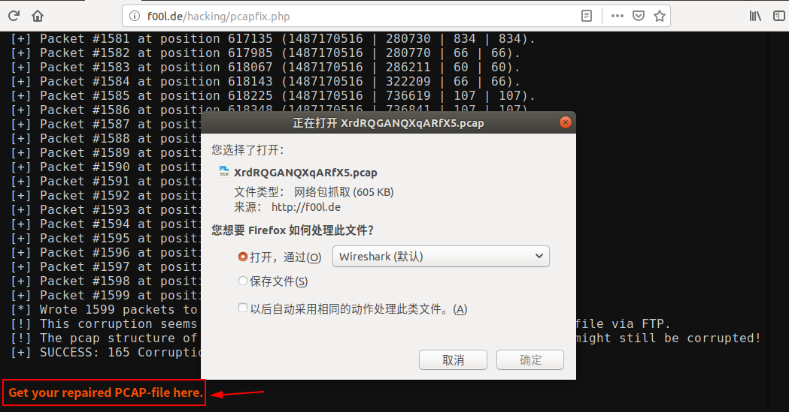
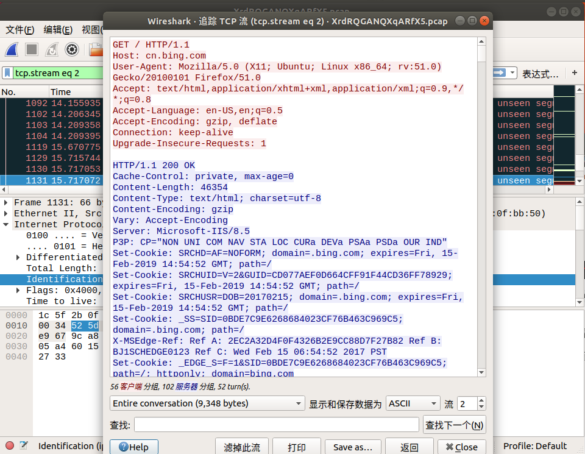
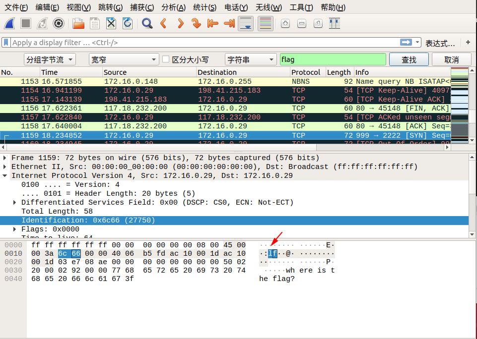
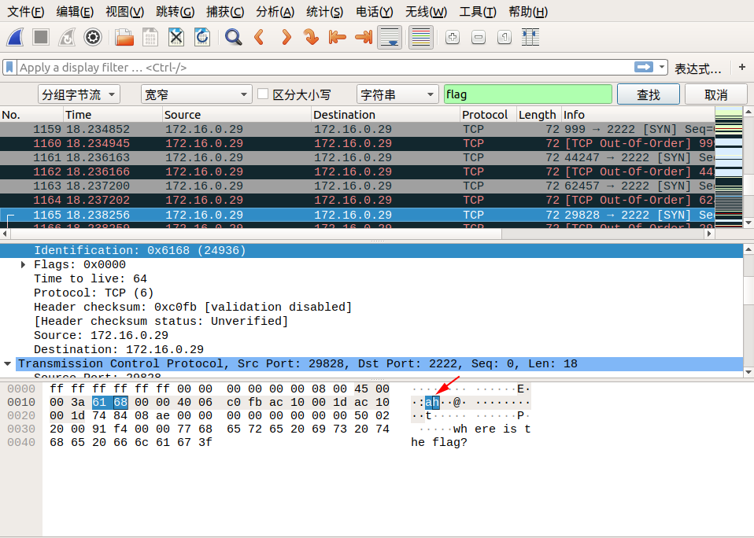
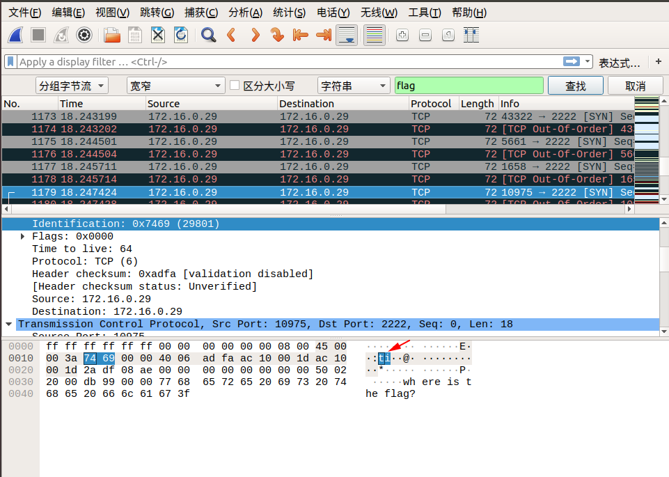

## PCAP File Structure

In general, there are few investigations about the `PCAP` file format, and usually can be directly repaired by means of off-the-shelf tools such as `pcapfix`.


- Tools
    - [PcapFix Online](https://f00l.de/hacking/pcapfix.php)
    - [PcapFix](https://github.com/Rup0rt/pcapfix/tree/devel)


General file structure:


```console
0                   1                   2                   3   
0 1 2 3 4 5 6 7 8 9 0 1 2 3 4 5 6 7 8 9 0 1 2 3 4 5 6 7 8 9 0 1
+-+-+-+-+-+-+-+-+-+-+-+-+-+-+-+-+-+-+-+-+-+-+-+-+-+-+-+-+-+-+-+-+
|                          Block Type                           |
+-+-+-+-+-+-+-+-+-+-+-+-+-+-+-+-+-+-+-+-+-+-+-+-+-+-+-+-+-+-+-+-+
|                      Block Total Length                       |
+-+-+-+-+-+-+-+-+-+-+-+-+-+-+-+-+-+-+-+-+-+-+-+-+-+-+-+-+-+-+-+-+
/                          Block Body                           /
/          /* variable length, aligned to 32 bits */            /
+-+-+-+-+-+-+-+-+-+-+-+-+-+-+-+-+-+-+-+-+-+-+-+-+-+-+-+-+-+-+-+-+
|                      Block Total Length                       |
+-+-+-+-+-+-+-+-+-+-+-+-+-+-+-+-+-+-+-+-+-+-+-+-+-+-+-+-+-+-+-+-+

```

The common block types defined are:


1. Section Header Block: it defines the most important characteristics of the capture file.

2. Interface Description Block: it defines the most important characteristics of the interface(s) used for capturing traffic.

3. Packet Block: it contains a single captured packet or a portion of it.

4. Simple Packet Block: it contains a single captured packet, or a portion of it, with only a minimal set of information about it.

5. Name Resolution Block: it defines the mapping from numeric addresses present in the packet dump and the canonical name counterpart.

6. Capture Statistics Block: it defines how to store some statistical data (e.g. packet dropped, etc) which can be useful to understand the conditions in which the capture has been made.


## Common Blocks


### Section Header Block


Must exist, indicating the beginning of the file.


```console
0                   1                   2                   3   
0 1 2 3 4 5 6 7 8 9 0 1 2 3 4 5 6 7 8 9 0 1 2 3 4 5 6 7 8 9 0 1
+-+-+-+-+-+-+-+-+-+-+-+-+-+-+-+-+-+-+-+-+-+-+-+-+-+-+-+-+-+-+-+-+
|                Byte-Order Magic (0x1A2B3C4D)                  |
+-+-+-+-+-+-+-+-+-+-+-+-+-+-+-+-+-+-+-+-+-+-+-+-+-+-+-+-+-+-+-+-+
|   Major Version              |    Minor Version               |
+-+-+-+-+-+-+-+-+-+-+-+-+-+-+-+-+-+-+-+-+-+-+-+-+-+-+-+-+-+-+-+-+
|                                                               |
|                          Section Length                       |
|                                                               |
+-+-+-+-+-+-+-+-+-+-+-+-+-+-+-+-+-+-+-+-+-+-+-+-+-+-+-+-+-+-+-+-+
/                                                               /
/                      Options (variable)                       /
/                                                               /
+-+-+-+-+-+-+-+-+-+-+-+-+-+-+-+-+-+-+-+-+-+-+-+-+-+-+-+-+-+-+-+-+

```


### Interface Description Block


Must exist, describe interface characteristics


```console
0                   1                   2                   3   
0 1 2 3 4 5 6 7 8 9 0 1 2 3 4 5 6 7 8 9 0 1 2 3 4 5 6 7 8 9 0 1
+-+-+-+-+-+-+-+-+-+-+-+-+-+-+-+-+-+-+-+-+-+-+-+-+-+-+-+-+-+-+-+-+
|           LinkType            |           Reserved            |
+-+-+-+-+-+-+-+-+-+-+-+-+-+-+-+-+-+-+-+-+-+-+-+-+-+-+-+-+-+-+-+-+
|                  SnapLen(Amount of Data per Frame)            |
+-+-+-+-+-+-+-+-+-+-+-+-+-+-+-+-+-+-+-+-+-+-+-+-+-+-+-+-+-+-+-+-+
/                                                               /
/                      Options (variable)                       /
/                                                               /
+-+-+-+-+-+-+-+-+-+-+-+-+-+-+-+-+-+-+-+-+-+-+-+-+-+-+-+-+-+-+-+-+
```


### Packet Block


```console
0                   1                   2                   3   
0 1 2 3 4 5 6 7 8 9 0 1 2 3 4 5 6 7 8 9 0 1 2 3 4 5 6 7 8 9 0 1
+-+-+-+-+-+-+-+-+-+-+-+-+-+-+-+-+-+-+-+-+-+-+-+-+-+-+-+-+-+-+-+-+
|         Interface ID          |          Drops Count          |
+-+-+-+-+-+-+-+-+-+-+-+-+-+-+-+-+-+-+-+-+-+-+-+-+-+-+-+-+-+-+-+-+
|                     Timestamp (High)    In Unix Format        |
+-+-+-+-+-+-+-+-+-+-+-+-+-+-+-+-+-+-+-+-+-+-+-+-+-+-+-+-+-+-+-+-+
|                        Timestamp (Low)                        |
+-+-+-+-+-+-+-+-+-+-+-+-+-+-+-+-+-+-+-+-+-+-+-+-+-+-+-+-+-+-+-+-+
|                         Captured Len                          |
+-+-+-+-+-+-+-+-+-+-+-+-+-+-+-+-+-+-+-+-+-+-+-+-+-+-+-+-+-+-+-+-+
|                          Packet Len                           |
+-+-+-+-+-+-+-+-+-+-+-+-+-+-+-+-+-+-+-+-+-+-+-+-+-+-+-+-+-+-+-+-+
/                          Packet Data                          /
/          /* variable length, aligned to 32 bits */            /
+-+-+-+-+-+-+-+-+-+-+-+-+-+-+-+-+-+-+-+-+-+-+-+-+-+-+-+-+-+-+-+-+
/                      Options (variable)                       /
+-+-+-+-+-+-+-+-+-+-+-+-+-+-+-+-+-+-+-+-+-+-+-+-+-+-+-+-+-+-+-+-+
```


## CTF Example


### Baidu Cup - Find the Flag


> Download the challenge [here](https://github.com/ctf-wiki/ctf-challenges/blob/master/misc/cap/%E7%AC%AC%E4%B8%80%E5%B1%8A%E2%80%9C%E7%99%BE%E5%BA%A6%E6%9D%AF%E2%80%9D%E4%BF%A1%E6%81%AF%E5%AE%89%E5%85%A8%E6%94%BB%E9%98%B2%E6%80%BB%E5%86%B3%E8%B5%9B%20%E7%BA%BF%E4%B8%8A%E9%80%89%E6%8B%94%E8%B5%9B-find%20the%20flag/findtheflag.cap)


First, the challenge title `Find the Flag` hints that we must find the string contains `flag`.


**First step, search for `flag` string**


We will search for `flag` string with the `strings` command. Windows users can use the search function of `notepad++`.

The search command:

```shell
strings findtheflag.cap | grep flag
```


We found out that a lot of matched strings, but it's not what we looking for.


**Step 2, Repair the Traffic Packets File**


We opened this PCAP file with `wireshark`


However, it displayed an error message and seems corrupted, so we need to fix it.


We used this online tool to helps us quickly fix its PCAP file: http://f00l.de/hacking/pcapfix.php





After the repair is complete, click `Get your repaired PCAP-file here.` to download the repaired PCAP file, then open it with `wireshark`.


Since we still have to find the `flag`, we will analyze traffics with `wireshark`.


**Step 3, Follow the TCP Streams**


Let's follow the TCP Streams and see if there is anything interesting?





By following the `TCP` streams, we found some version information, cookie, etc. We still found something interesting.


From `tcp.stream eq 29` to `tcp.stream eq 41`, they show the words `where is the flag?`. Is it hinting the `flag` is here?


**Step 4, Find the grouped byte stream**


When we follow `tcp.stream eq 29`, we saw `lf` in the `Identification` message. We can continue to follow the next stream, `Identification` in `tcp.stream eq 30` we see `ga`. We discovered that corresponding `Identification` fields in the two packets when combined from right to left, becomes `flag`! So we can guess the `flag` is inside the `Identification` fields.


We can find the remaining parts of the flag by using the search by strings feature in `wireshark`.
Edit --> Find Packet --> Select Packet bytes --> Select Narrow & Wide --> Select String, then enter `flag` in search field.


Here are the screenshots of the search:










So the final `flag` is: **flag{aha!_you_found_it!}**


## References


- http://www.tcpdump.org/pcap/pcap.html

- https://zhuanlan.zhihu.com/p/27470338

- https://www.cnblogs.com/ECJTUACM-873284962/p/9884447.html
