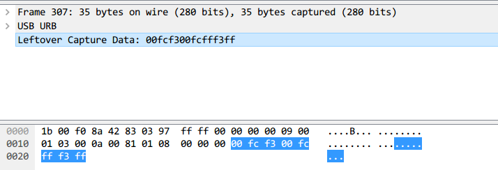
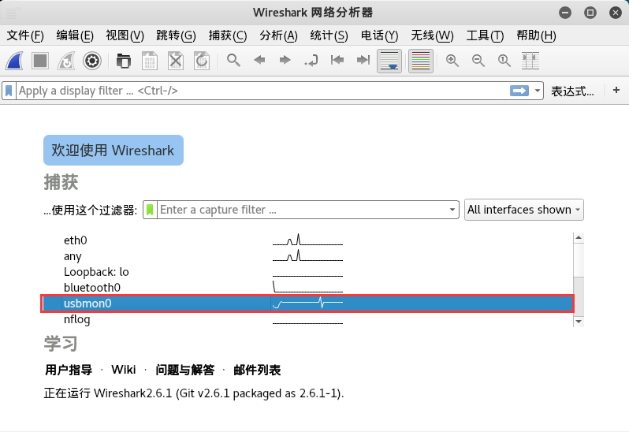
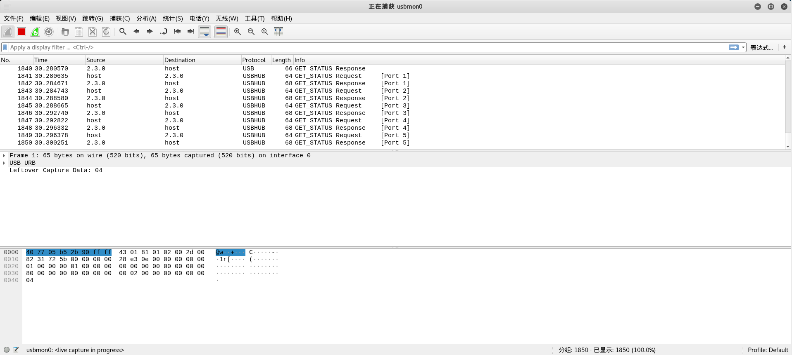
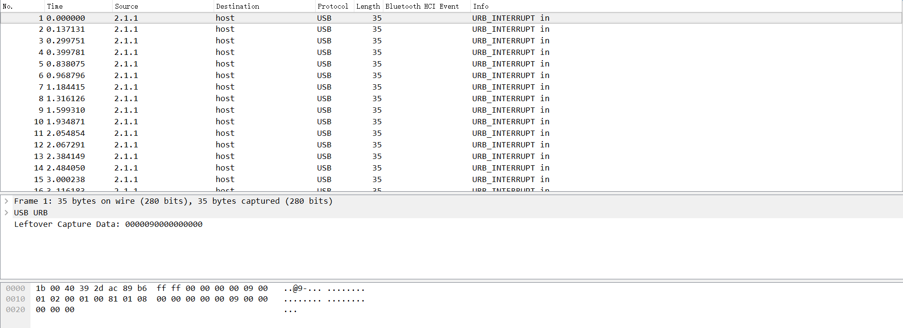
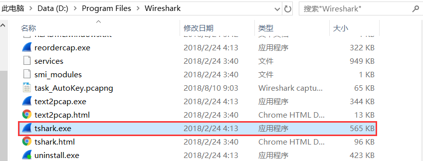

### USB


[USB Details](https://www.usb.org/sites/default/files/documents/hut1_12v2.pdf)


#### Mouse


The data length of a mouse packet is 4 bytes. The first byte represents buttons pressed. `0x00` is no buttons pressed, `0x01` indicates left button pressed, and `0x02` indicates right button pressed. The second byte is a signed byte, where the highest bit is the sign bit. When positive, it represents how many pixels the mouse has moved horizontally to the right. When negative, it shows how many pixels it has moved horizontally to the left. The third byte, like the second byte, represents an offset that moves vertically up and down.


By extracting those bytes in the USB mouse packets, you can recover the mouse movement.


#### Keyboard


The data length of a keyboard packet is 8 bytes.

The keystroke is at the 3rd byte.





Each value corresponds to different keys.


The full keyboard keymap can be found [here](https://www.usb.org/sites/default/files/documents/hut1_12v2.pdf) on page 53 to 59.

By extracting 3rd bytes within the keyboard packets, you can recover all the keystrokes pressed.


#### USB Traffic Packet Capture


Before we get started, let's introduce some of the basics of `USB`.

`USB` has different specifications, the following are three different types of `USB`:

```
l USB UART
l USB HID
l USB Memory
```

`UART` or `Universal Asynchronous Receiver/Transmitter` is a simple device that uses `USB` to receive and transmit data.

`HID` stands for human interface. This type is suitable for interactive applications such as keyboards, mice, gamepads, and digital display devices.

The last is `USB Memory`, or data storage. `External HDD`, `thumb drive/flash drive`, etc. are all of this type.

The most widely used `USB` type is `USB Memory`.

Each `USB` device (especially `HID` or `Memory`) has a vendor `ID (Vendor ID)` and a product identifier (Product Id). `Vendor ID` is used to mark which manufacturer made this `USB` device. `Product ID` is used for different types of products.

An example:


The above picture is a list of `USB` devices connected to my computer in a virtual machine.

In this example, I have a wireless mouse under `VMware`, which is a `HID` device. This device is running normally. You can see all the `USB` devices connected with the `lsusb` command.

Now, you can find out which one is this mouse?

Correct! It is the fourth one:

```
Bus 002 Device 002: ID 0e0f:0003 VMware, Inc. Virtual Mouse
```

`ID 0e0f:0003` is the `Vendor-Product ID` pair, where the value of `Vendor ID` is `0e0f` and the value of `Product ID` is `0003`.

`Bus 002 Device 002` means the `usb` device is connected. This should be noted.

We ran `Wireshark` with `root` permission to capture the `USB` data stream. However, we don't recommend it.

We need to give the user enough permissions to get the `usb` data stream in `Linux`. We can use `udev` to achieve our goal. We need to create a user group `usbmon` and add our account to this group.


```shell
addgroup usbmon
gpasswd -a $USER usbmon
echo 'SUBSYSTEM=="usbmon", GROUP="usbmon", MODE="640"' > /etc/udev/rules.d/99-usbmon.rules
```


Next, we need the `usbmon` kernel module. If the module is not loaded, we can load the module with the following command:


```shell
modprobe usbmon
```


Open `wireshark` and you will see `usbmonX` where `X` represents the number.

It should look like this (note we are running it as `root`):





If the interface is active or there is data flow, `wireshark`  will display it as a wave next to that interface.

So, which one should we choose?

Correct!, `usbmon0`. Open that and you can observe the `usb` packets.





Through capturing the `usb` packets, we can learn the communication and working principles used between the USB device and the host. Furthermore, we can analyze the `usb` packets.


### CTF Examples


#### UsbKeyboardDataHacker


Based on the previous sections, we have a rough understanding of the `USB` traffic packet capture.

Let's talk about how to analyze a `USB` traffic packet capture.

For details on the `USB` protocol, see the [Wireshark wiki](https://wiki.wireshark.org/USB)

> Download the PCAP file [here](https://github.com/WangYihang/UsbKeyboardDataHacker/blob/master/example.pcap).

Let's start with a simple example on `GitHub`:





We can know that the data part of the `USB` protocol is in the `Leftover Capture Data` field.

**Mac and Linux**

You can use the `tshark` command to extract the `Leftover Capture Data` field.

The command is as follows:

```shell
tshark -r example.pcap -T fields -e usb.capdata > usbdata.txt
```

**Windows**

There is a `tshark.exe` in the `wireshark` directory. For example, on my machine it's at `D:\Program Files\Wireshark\tshark.exe`.





Run `cmd` and navigate to the current directory.

The command is as follows:

```
tshark.exe -r example.pcap -T fields -e usb.capdata > usbdata.txt
```

For detailed usage of the `tshark` command, see the [Wireshark official documentation](https://www.wireshark.org/docs/man-pages/tshark.html)

Run the command and open at `usbdata.txt`. You will see the size of the data is 8 bytes.


The data length of the keyboard packet is `8` bytes, the keystroke information is at the 3rd byte. Each time the `key stroke` will generate a `keyboard event usb packet`.

The data length of the mouse data packet is `4` bytes. The first byte represents the button. When the value is `0x00`, it means there is no button. When it is 0x01, it means the left button. When it is `0x02`, it means the right button. The second byte can be thought as a `signed byte` type, with the most significant bit as the sign bit. When this value is positive, it represents how many pixels the mouse is horizontally shifted to the right. When it is negative, it represents how many pixels are horizontally shifted to the left. The third byte is similar to the second byte and represents the offset of the vertical up and down movement.

We can find the meaning of each value [here](http://www.usb.org/developers/hidpage/Hut1_12v2.pdf). With this information, we can make a key map.

Here is a table of keymap for keyboard strokes, which can be found from the link above.


We write the following script:

```python
mappings = { 0x04:"A",  0x05:"B",  0x06:"C", 0x07:"D", 0x08:"E", 0x09:"F", 0x0A:"G",  0x0B:"H", 0x0C:"I",  0x0D:"J", 0x0E:"K", 0x0F:"L", 0x10:"M", 0x11:"N",0x12:"O",  0x13:"P", 0x14:"Q", 0x15:"R", 0x16:"S", 0x17:"T", 0x18:"U",0x19:"V", 0x1A:"W", 0x1B:"X", 0x1C:"Y", 0x1D:"Z", 0x1E:"1", 0x1F:"2", 0x20:"3", 0x21:"4", 0x22:"5",  0x23:"6", 0x24:"7", 0x25:"8", 0x26:"9", 0x27:"0", 0x28:"n", 0x2a:"[DEL]",  0X2B:"    ", 0x2C:" ",  0x2D:"-", 0x2E:"=", 0x2F:"[",  0x30:"]",  0x31:"\\", 0x32:"~", 0x33:";",  0x34:"'", 0x36:",",  0x37:"." }

nums = []

keys = open('usbdata.txt')
# tshark -r example.pcap -T fields -e usb.capdata > usbdata.txt

for line in keys:

    if line[:2] != '00' or line[4:6] != '00':
        nums.append(int(line[4:6],16))
    # 00:00:xx:....

keys.close()

output = ""

for n in nums:
    if n == 0:
        continue
    if n in mappings:
        output += mappings[n]
    else:
        output += '[unknown]'

print('output:' + output)
```

The results are as follows:


Here is the full solve script:

```python
#!/usr/bin/env python

import sys
import os

DataFileName = "usb.dat"

presses = []

normalKeys = {"04":"a", "05":"b", "06":"c", "07":"d", "08":"e", "09":"f", "0a":"g", "0b":"h", "0c":"i", "0d":"j", "0e":"k", "0f":"l", "10":"m", "11":"n", "12":"o", "13":"p", "14":"q", "15":"r", "16":"s", "17":"t", "18":"u", "19":"v", "1a":"w", "1b":"x", "1c":"y", "1d":"z","1e":"1", "1f":"2", "20":"3", "21":"4", "22":"5", "23":"6","24":"7","25":"8","26":"9","27":"0","28":"<RET>","29":"<ESC>","2a":"<DEL>", "2b":"\t","2c":"<SPACE>","2d":"-","2e":"=","2f":"[","30":"]","31":"\\","32":"<NON>","33":";","34":"'","35":"<GA>","36":",","37":".","38":"/","39":"<CAP>","3a":"<F1>","3b":"<F2>", "3c":"<F3>","3d":"<F4>","3e":"<F5>","3f":"<F6>","40":"<F7>","41":"<F8>","42":"<F9>","43":"<F10>","44":"<F11>","45":"<F12>"}

shiftKeys = {"04":"A", "05":"B", "06":"C", "07":"D", "08":"E", "09":"F", "0a":"G", "0b":"H", "0c":"I", "0d":"J", "0e":"K", "0f":"L", "10":"M", "11":"N", "12":"O", "13":"P", "14":"Q", "15":"R", "16":"S", "17":"T", "18":"U", "19":"V", "1a":"W", "1b":"X", "1c":"Y", "1d":"Z","1e":"!", "1f":"@", "20":"#", "21":"$", "22":"%", "23":"^","24":"&","25":"*","26":"(","27":")","28":"<RET>","29":"<ESC>","2a":"<DEL>", "2b":"\t","2c":"<SPACE>","2d":"_","2e":"+","2f":"{","30":"}","31":"|","32":"<NON>","33":"\"","34":":","35":"<GA>","36":"<","37":">","38":"?","39":"<CAP>","3a":"<F1>","3b":"<F2>", "3c":"<F3>","3d":"<F4>","3e":"<F5>","3f":"<F6>","40":"<F7>","41":"<F8>","42":"<F9>","43":"<F10>","44":"<F11>","45":"<F12>"}

def main():
    # check argv
    if len(sys.argv) != 2:
        print("Usage : ")
        print("        python UsbKeyboardHacker.py data.pcap")
        print("Tips : ")
        print("        To use this python script , you must install the tshark first.")
        print("        You can use `sudo apt-get install tshark` to install it")
        print("Author : ")
        print("        WangYihang <wangyihanger@gmail.com>")
        print("        If you have any questions , please contact me by email.")
        print("        Thank you for using.")
        exit(1)

    # get argv
    pcapFilePath = sys.argv[1]

    # get data of pcap
    os.system("tshark -r %s -T fields -e usb.capdata 'usb.data_len == 8' > %s" % (pcapFilePath, DataFileName))

    # read data
    with open(DataFileName, "r") as f:
        for line in f:
            presses.append(line[0:-1])
    # handle
    result = ""
    for press in presses:
        if press == '':
            continue
        if ':' in press:
            Bytes = press.split(":")
        else:
            Bytes = [press[i:i+2] for i in range(0, len(press), 2)]
        if Bytes[0] == "00":
            if Bytes[2] != "00" and normalKeys.get(Bytes[2]):
                result += normalKeys[Bytes[2]]
        elif int(Bytes[0],16) & 0b10 or int(Bytes[0],16) & 0b100000: # shift key is pressed.
            if Bytes[2] != "00" and normalKeys.get(Bytes[2]):
                result += shiftKeys[Bytes[2]]
        else:
            print("[-] Unknow Key : %s" % (Bytes[0]))
    print("[+] Found : %s" % (result))

    # clean the temp data
    os.system("rm ./%s" % (DataFileName))


if __name__ == "__main__":
    main()
```

We write the following script:


#### XMan - AutoKey


> Download the PCAP file [here](https://github.com/ctf-wiki/ctf-challenges/blob/master/misc/cap/Xman%E4%B8%89%E6%9C%9F%E5%A4%8F%E4%BB%A4%E8%90%A5%E6%8E%92%E4%BD%8D%E8%B5%9B%E7%BB%83%E4%B9%A0%E9%A2%98-AutoKey/Cryptanalysis-of-the-Autokey-Cipher/task_AutoKey.pcapng)


Run the script from earlier: `python UsbKeyboardDataHacker.py task_AutoKey.pcapng`

Then we got this output:
```
[+] Found : <CAP>a<CAP>utokey('****').decipheer('<CAP>mplrvffczeyoujfjkybxgzvdgqaurkxzolkolvtufblrnjesqitwahxnsijxpnmplshcjbtyhzealogviaaissplfhlfswfehjncrwhtinsmambvexo<DEL>pze<DEL>iz')
```


We can see that this is a autokey cipher, but how do we decode it without the key?

I found this [script](http://www.practicalcryptography.com/cryptanalysis/stochastic-searching/cryptanalysis-autokey-cipher/), which brute force the key.

The brute force script:

!!! note
    Run this script in Python2

```python
from ngram_score import ngram_score
from pycipher import Autokey
import re
from itertools import permutations

qgram = ngram_score('quadgrams.txt')
trigram = ngram_score('trigrams.txt')
ctext = 'MPLRVFFCZEYOUJFJKYBXGZVDGQAURKXZOLKOLVTUFBLRNJESQITWAHXNSIJXPNMPLSHCJBTYHZEALOGVIAAISSPLFHLFSWFEHJNCRWHTINSMAMBVEXPZIZ'
ctext = re.sub(r'[^A-Z]','',ctext.upper())

# keep a list of the N best things we have seen, discard anything else
class nbest(object):
    def __init__(self,N=1000):
        self.store = []
        self.N = N

    def add(self,item):
        self.store.append(item)
        self.store.sort(reverse=True)
        self.store = self.store[:self.N]

    def __getitem__(self,k):
        return self.store[k]

    def __len__(self):
        return len(self.store)
#init
N=100
for KLEN in range(3,20):
    rec = nbest(N)

    for i in permutations('ABCDEFGHIJKLMNOPQRSTUVWXYZ',3):
        key = ''.join(i) + 'A'*(KLEN-len(i))
        pt = Autokey(key).decipher(ctext)
        score = 0
        for j in range(0,len(ctext),KLEN):
            score += trigram.score(pt[j:j+3])
        rec.add((score,''.join(i),pt[:30]))

    next_rec = nbest(N)
    for i in range(0,KLEN-3):
        for k in xrange(N):
            for c in 'ABCDEFGHIJKLMNOPQRSTUVWXYZ':
                key = rec[k][1] + c
                fullkey = key + 'A'*(KLEN-len(key))
                pt = Autokey(fullkey).decipher(ctext)
                score = 0
                for j in range(0,len(ctext),KLEN):
                    score += qgram.score(pt[j:j+len(key)])
                next_rec.add((score,key,pt[:30]))
        rec = next_rec
        next_rec = nbest(N)
    bestkey = rec[0][1]
    pt = Autokey(bestkey).decipher(ctext)
    bestscore = qgram.score(pt)
    for i in range(N):
        pt = Autokey(rec[i][1]).decipher(ctext)
        score = qgram.score(pt)
        if score > bestscore:
            bestkey = rec[i][1]
            bestscore = score       
    print bestscore,'autokey, klen',KLEN,':"'+bestkey+'",',Autokey(bestkey).decipher(ctext)
```


The results of running out are as follows:


We saw the word `flag` in one of the results:


```shell
(-674.9145695645551, 'autokey, klen', 8, ':"FLAGHERE",', 'HELLOBOYSANDGIRLSYOUARESOSMARTTHATYOUCANFINDTHEFLAGTHATIHIDEINTHEKEYBOARDPACKAGEFLAGISJHAWLZKEWXHNCDHSLWBAQJTUQZDXZQPF')
```

After splitting words, we see :

```
HELLO
BOYS
AND
GIRLS
YOU
ARE
SO
SMART
THAT
YOU
CAN
FIND
THE
FLAG
THAT
THEM
HERE
IN
THE
KEY
BOARD
PACKAGE
FLAG
IS
JHAWLZKEWXHNCDHSLWBAQJTUQZDXZQPF
```

The last line contains the flag: `flag{JHAWLZKEWXHNCDHSLWBAQJTUQZDXZQPF}`


### Related CTF Challenges


- [UsbMiceDataHacker](https://github.com/WangYihang/UsbMiceDataHacker)


### References

- https://github.com/WangYihang/UsbMiceDataHacker

- https://github.com/WangYihang/UsbKeyboardDataHacker

- https://www.anquanke.com/post/id/85218

- https://www.cnblogs.com/ECJTUACM-873284962/p/9473808.html

- https://blog.csdn.net/songze_lee/article/details/77658094

- https://wiki.wireshark.org/USB

- http://www.usb.org/developers/hidpage/Hut1_12v2.pdf

- https://www.wireshark.org/docs/man-pages/tshark.html

- http://www.practicalcryptography.com/cryptanalysis/stochastic-searching/cryptanalysis-autokey-cipher/

- https://hackfun.org/2017/02/22/CTF%E4%B8%AD%E9%82%A3%E4%BA%9B%E8%84%91%E6%B4%9E%E5%A4%A7%E5%BC%80%E7%9A%84%E7%BC%96%E7%A0%81%E5%92%8C%E5%8A%A0%E5%AF%86/
