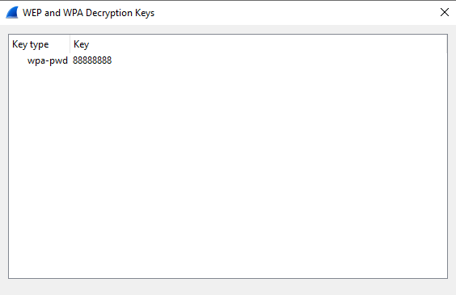

### WIFI

> `802.11` is a common standard for wireless LANs today.

 Common authentication methods:

- None
- `WEP‍‍`
- `WPA/WPA2-PSK` (pre-shared key)‍‍
- `WPA2 802.1X` (`radius` certificate)

#### WPA-PSK

The general process of authentication is shown:

Four handshakes:

1. 4 Ways handshake starts at the AP, it then generates a random string (ANonce) and sends it to the requester.
2. The requester also generates its own random SNonce, and then uses these two Nonces and PMK to generate the PTK. The requester replies message 2 to the authenticator and a MIC (message integrity code) as the verification of the PMK.
3. The authenticator sends information from requester’s message 2 back to requester, once it’s verified, it will generate GTK if needed. Then, sends it as message 3.
4. The requester receives message 3, verifies the MIC, installs the key, sends a message 4, and a confirmation message. The verifier receives message 4, verifies the MIC, installs the same key.

### CTF Examples

#### Experiment Lab - shipin

> Download the PCAP file [here](https://github.com/ctf-wiki/ctf-challenges/tree/master/misc/cap/%E5%AE%9E%E9%AA%8C%E5%90%A7-shipin)

From a large number of `Deauth` packets, we obtained the handshake packets in the traffics, which we can use to crack the WIFI password.

Next, we crack the password.

You can use the `aircrack` suite.

Run the command `aircrack-ng shipin.cap -w /usr/share/wordlists/rockyou.txt`

We found the key, `88888888`.

Now, we can use the key found to decrypt the packets within the WIFI network.

Go to `Edit --> Preferences --> Protocols --> IEEE802.11 --> Edit` in Wireshark.

Fill in the form `key-type:key` to decrypt the packets to see the clear text traffic.

There is no flag in this challenge.

### References

- http://www.freebuf.com/articles/wireless/58342.html

- http://blog.csdn.net/keekjkj/article/details/46753883
