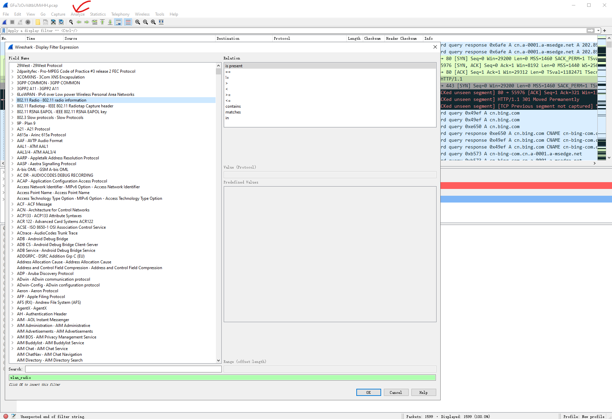
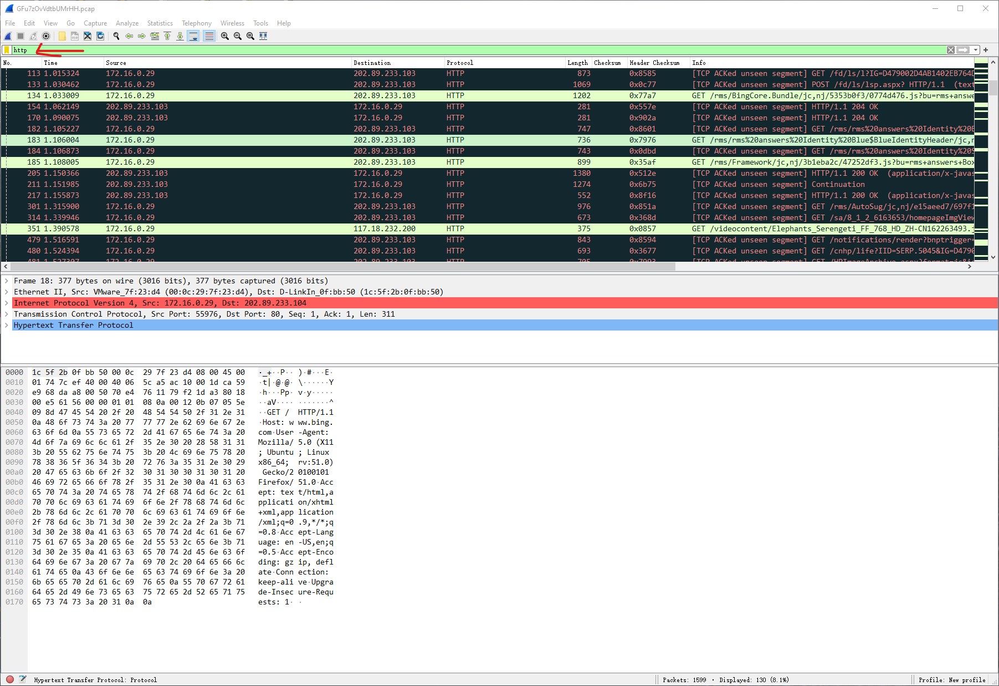
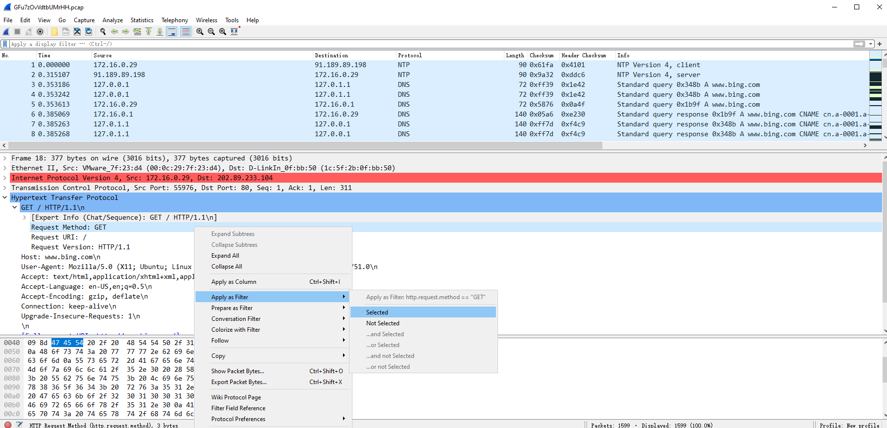
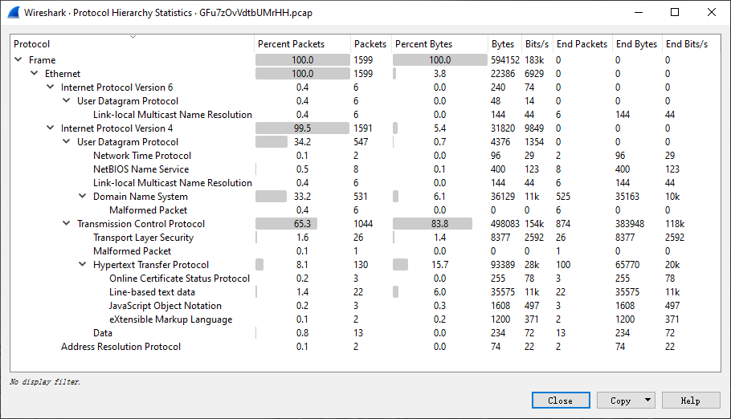
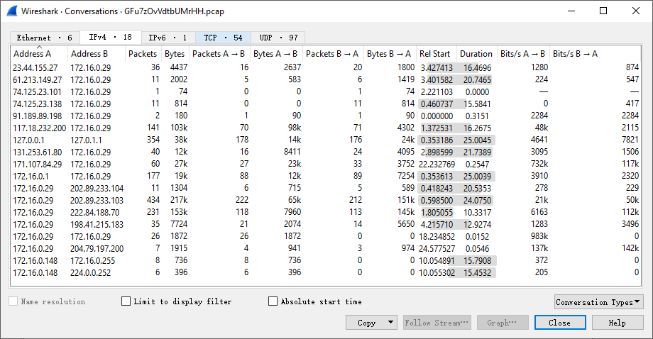
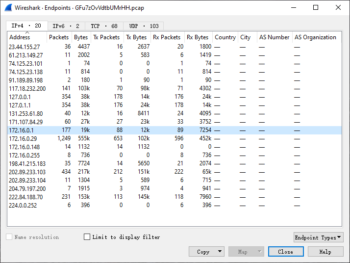
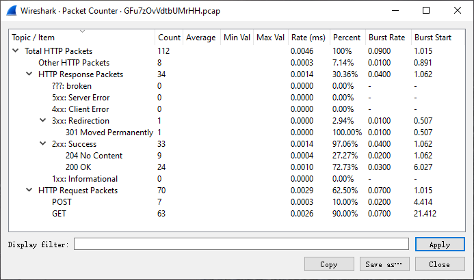

## Wireshark Common Features


### Display Filter


Display filters can use several different parameters as matching criteria, such as IP address, protocol, port number, and some protocol header’s parameters. In addition, users use some conditionals and concatenation operators to create more complex expressions. Users can combine different expressions to filter out a precise range of packets. All packets displayed can be filtered by bytes within the packets.


A display filter follows this structure:

```
[not] Expression [and|or] [not] Expression
```


Often used operators:


| Operator | Description |
| -------- | ----------- |
| ==       | Equal |
| !=       | Not Equal |
| >        | Greater Than |
| <        | Less Than |
| >=       | Greater Than or Equal To |
| <=       | Less Than or Equal To |
| &&       | AND |
| \|\|     | OR |
| !       | NOT |


#### Filter Methods

There are many ways to do display filter:

* Display filter expression

    `Analyze --> Display Filter Expression`


   


* Display filter toolbar


   


* Right clicking on a specific filed and apply selected as filter


   


!!! note

You can obtain the complex filtering expression with this method.


### Statistics Information


#### Protocol Hierarchy


`Statistics --> Protocol Hierarchy`

A hierarchy of all the protocols contained in the file.





#### Conversations


`Statistics --> Conversations`

All traffic occurring between IP addresses of a particular endpoint.





!!! note

- Check the IP address that sent or received many data streams. If you know that server, then the problem is solved. However, it’s possible that is it just some device scanning the network or generating a large amount of data.

- Check for scan patterns. If a device made one scan, then that’s likely normal. For example, SNMP software sent a ping message to find the network. However, if there are many scans, then something fishy is happening.


#### Endpoints


`Statistics --> Endpoints`

List all endpoints found by Wireshark.





#### HTTP - Packet Counter


`Statistics --> HTTP --> Packet Counter`

Count HTTP packets.



